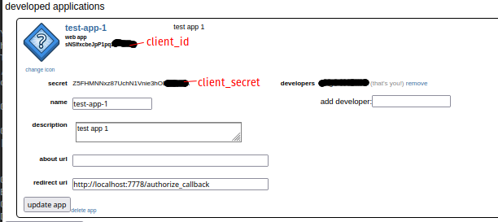
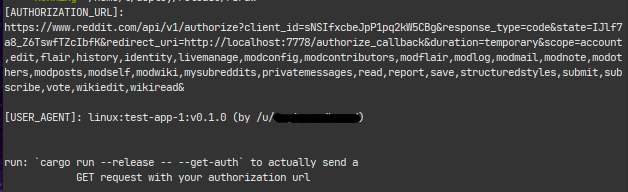
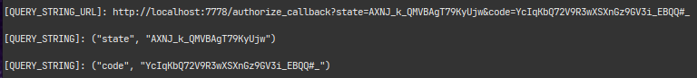
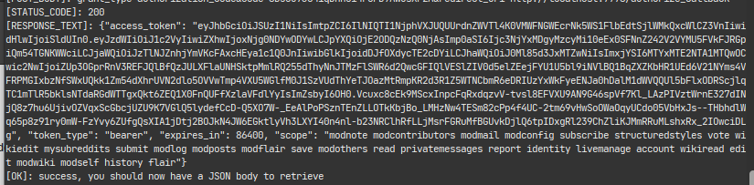

# RSRAW(rust reddit api wrapper)

Required:
- Rust
- reddit account

# Setup

## Install dependencies
Rust reddit api wrapper
- `cargo add roux`

toml parser
- `cargo add toml`

serializer/deserializer
- `cargo add serde`
- `cargo add serde_derive`

If you don't want to type all of that: `cargo add roux toml serde serde_derive`

---

## Get your app credentials
Login to your reddit account:
preferences > apps

To use Reddit’s API, you need a unique and descriptive user agent. The recommended format is `<platform>:<app ID>:<version string> (by u/<Reddit username>)`

create an app

## Fill out `auth.toml`
- put your `client id` and `client secret` along with your user agent, username, and password into `auth.toml` 

## Run

`cargo run --release`

If you put in correct credentials in `auth.toml` at the root of your project you should also get a valid redirect_url:

Follow the instructions and if you're successful you'll get an access token:

---

## Examples
run examples: `cargo run --example <example>`

---

## Testing
run tests:`cargo test`

The #[cfg(test)] annotation on the tests module tells Rust to compile and run the test code only when you run cargo test, not when you run `cargo build`

Troubleshooting
- error - `error: could not find system library 'openssl' required by the 'openssl-sys' crate`
- solution: `sudo apt install libssl-dev`